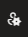
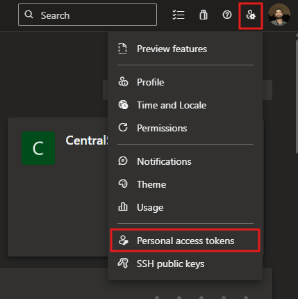
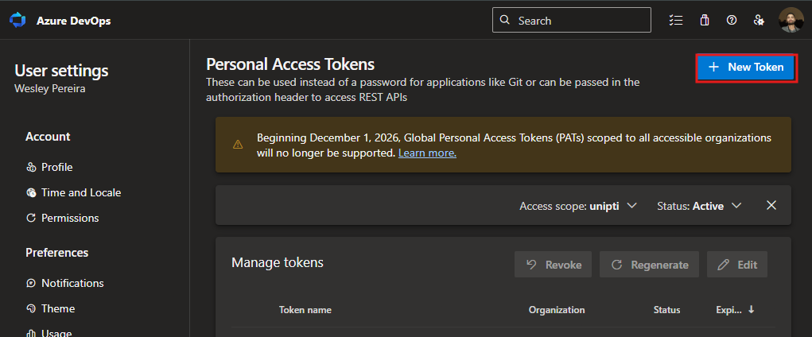
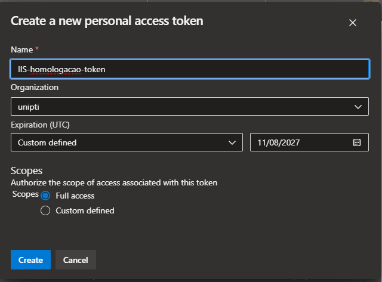
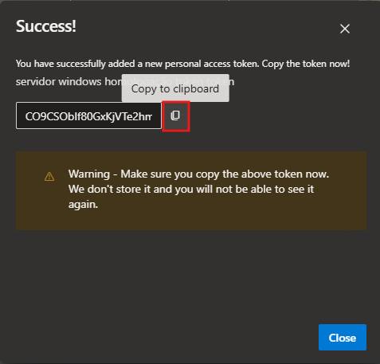
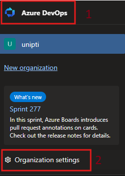
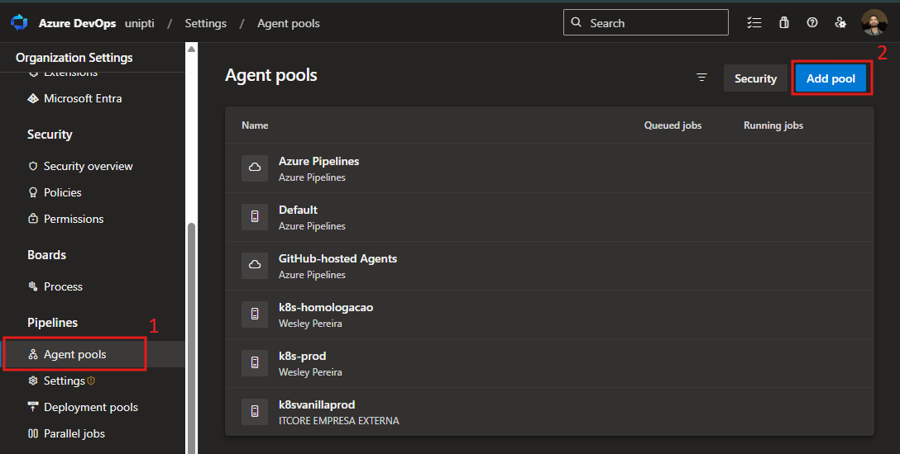
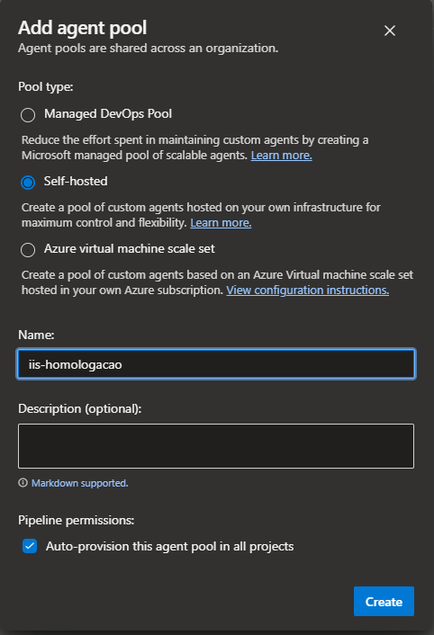
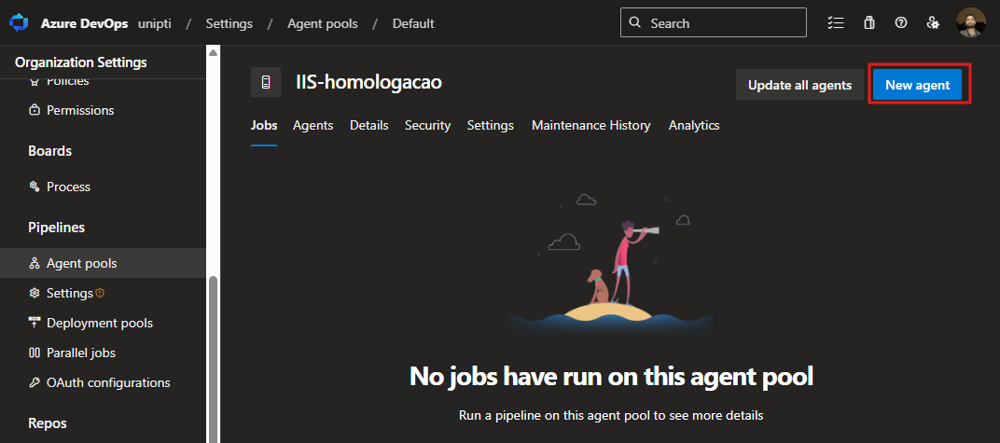
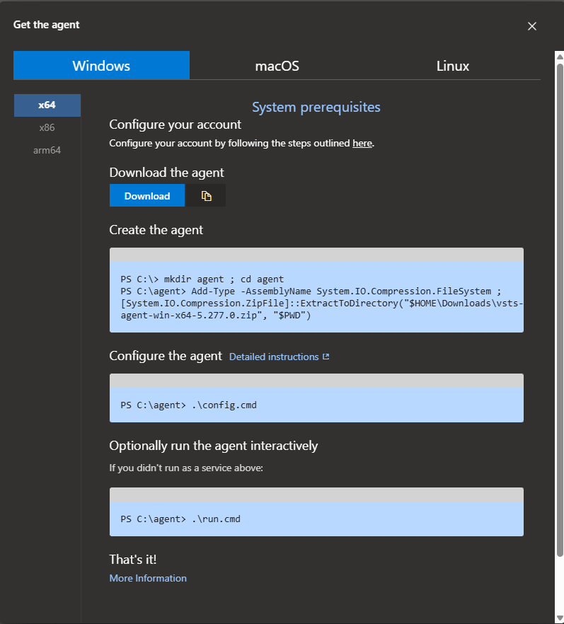

# Links Auxiliares - Resumo

## 1. Tokens de Acesso Pessoal (PAT)
🔗 [Documentação oficial](https://learn.microsoft.com/pt-br/azure/devops/organizations/accounts/use-personal-access-tokens-to-authenticate?view=azure-devops&tabs=Windows)

- Autenticação alternativa ao Azure DevOps.
- Substitui senha para ferramentas externas.
- Configure em *Configurações do Usuário > Tokens de Acesso Pessoal*.

---

## 2. Agente Windows para Pipelines
🔗 [Configuração de agente Windows](https://learn.microsoft.com/pt-br/azure/devops/pipelines/agents/windows-agent?view=azure-devops&tabs=IP-V4)

- Agente auto-hospedado para execução de pipelines em Windows.
- Suporta Windows 10/11 e Server (versões específicas).
- Necessário para builds e deploys baseados em Windows.

---


# Azure Pipelines agents (PARTE DO EMERSON)

Segue esse as instruções para gerar um PAT {Personal access token} , para configurar o agent  no azure devops.


1. Entre em sua organização ( https://dev.azure.com/unipti)

2. Na sua página inicial, abra as configurações do usuário  e selecione **Tokens de acesso pessoal**.

    

3. Selecione + **New Token**.

    

4. Dê um nome ao seu token (IIS-homologacao-token), selecione a organização onde deseja usá-lo e defina-o para expirar automaticamente após um determinado número de dias.

    

5. Quando terminar, copie o token e armazene-o em um local seguro. Para a sua segurança, ele não será exibido novamente.

    
---
# Criar agent pool (PARTE DO EMERSON)

1. Abra um navegador e navegue até a guia Pools de agentes para sua organização do Azure Pipelines ou Azure DevOps Server ou servidor TFS:

    A. Entre em sua organização (https://dev.azure.com/unipti).

    B. Selecione as **configurações da Organização**.

    

    C. Selecione **Pools de Agentes** e clique em **Add pool**.

    

    D. Clique em **Self-hosted** coloque um nome, pode ser (IIS-homologacao), e clique em **Create**.
    
    
---

# Configurar o Agente (PARTE DO SERVIDOR)

1. Selecione o pool criado (IIS-homologacao) no lado direito da página e clique em **New agent**.
    
    

    ## Download do agente

    Clique em **Download** ou [acesse esse link](https://download.agent.dev.azure.com/agent/5.277.0/vsts-agent-win-x64-5.277.0.zip).

    Faça o download do agente (arquivo .zip) para a pasta `Downloads` ou local de sua preferência.
    

    ## Criar (extrair) o agente

    Crie a pasta de instalação e extraia o conteúdo do arquivo baixado:

    ```powershell
    PS C:\> mkdir agent ; cd agent
    PS C:\agent> Add-Type -AssemblyName System.IO.Compression.FileSystem ;
    [System.IO.Compression.ZipFile]::ExtractToDirectory("$HOME\Downloads\vsts-agent-win-x64-5.277.0.zip", "$PWD")
    ```
    ## Configurar o agente
    Execute o script de configuração para definir as opções de conexão e autenticação 

    ```powershell
    PS C:\agent> .\config.cmd
    ```
    Siga as instruções exibidas no terminal para informar:

    - URL da organização ou coleção de projetos (https://dev.azure.com/unipti);
    - Tipo de autenticação (PAT, integrado, etc.), no caso é **PAT**. Pegue o **PAT** com o **Emerson**;
    - Nome do pool e nome do agente (**IIS-homologacao**).

    Durante o processo, quando a pergunta Enter run agent as service? (Y/N) aparecer, responda com **Y** (**sim**). O script então solicitará as credenciais da conta de serviço que será usada para executar o agente.
    Após a reinicialização da máquina, o serviço do agente deve ser iniciado automaticamente e o agente deve aparecer como "Online" no Azure DevOps.

    
